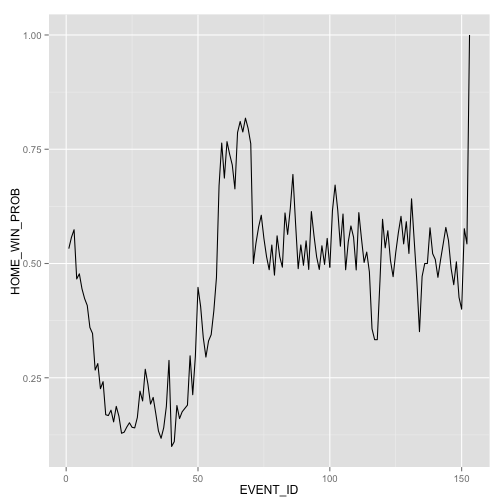
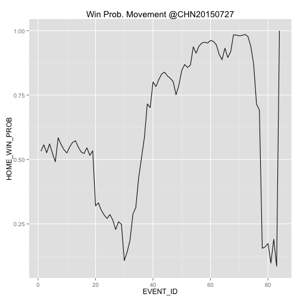

エキサイティング度合いを勝利確率変動で見よう
===


```r
library(dplyr)
library(readr)
library(ggplot2)
library(Lahman)
library(data.table)

fullname_batid =
  Master %>% 
  mutate(FULLNAME = paste(nameFirst, nameLast)) %>% 
  mutate(BAT_ID = retroID) %>% 
  select(BAT_ID, FULLNAME)
```


```r
## データを作る
pbpData = fread("all2015.csv", header=FALSE)
namedata = fread("names.csv", header = FALSE) %>% unlist
names(pbpData) = namedata

## 勝率テーブル
winProbData = read_csv("win_prob.csv")
## 内容
winProbData %>% head %>%
  xtable::xtable() %>% print("html")
```

<!-- html table generated in R 3.2.2 by xtable 1.7-4 package -->
<!-- Sun Dec 20 00:20:27 2015 -->
<table border=1>
<tr> <th>  </th> <th> INN_CT </th> <th> BAT_HOME_ID </th> <th> OUTS_CT </th> <th> RUNNERS </th> <th> HOME_AWAY </th> <th> HOME_LOSES </th> <th> GAMES </th> <th> HOME_WINS </th>  </tr>
  <tr> <td align="right"> 1 </td> <td align="right">   1 </td> <td align="right">   0 </td> <td align="right">   0 </td> <td align="right">   0 </td> <td align="right">  -8 </td> <td align="right">   1 </td> <td align="right">   1 </td> <td align="right">   0 </td> </tr>
  <tr> <td align="right"> 2 </td> <td align="right">   1 </td> <td align="right">   0 </td> <td align="right">   0 </td> <td align="right">   0 </td> <td align="right">  -7 </td> <td align="right">   1 </td> <td align="right">   1 </td> <td align="right">   0 </td> </tr>
  <tr> <td align="right"> 3 </td> <td align="right">   1 </td> <td align="right">   0 </td> <td align="right">   0 </td> <td align="right">   0 </td> <td align="right">  -6 </td> <td align="right">  10 </td> <td align="right">  10 </td> <td align="right">   0 </td> </tr>
  <tr> <td align="right"> 4 </td> <td align="right">   1 </td> <td align="right">   0 </td> <td align="right">   0 </td> <td align="right">   0 </td> <td align="right">  -5 </td> <td align="right">  26 </td> <td align="right">  30 </td> <td align="right">   4 </td> </tr>
  <tr> <td align="right"> 5 </td> <td align="right">   1 </td> <td align="right">   0 </td> <td align="right">   0 </td> <td align="right">   0 </td> <td align="right">  -4 </td> <td align="right"> 137 </td> <td align="right"> 164 </td> <td align="right">  27 </td> </tr>
  <tr> <td align="right"> 6 </td> <td align="right">   1 </td> <td align="right">   0 </td> <td align="right">   0 </td> <td align="right">   0 </td> <td align="right">  -3 </td> <td align="right"> 272 </td> <td align="right"> 363 </td> <td align="right">  91 </td> </tr>
   </table>
1行目は、

1回表、0アウトランナー無し、アウェイで8点負けている状況という試合が1つあった、ということです。

HOME-AWAYのフィールドが点差を表しています。


```r
## 10点差以上は10にまとめる
winProbDataMod = 
  winProbData %>% 
  mutate(HOME_AWAY_MOD = ifelse(abs(HOME_AWAY) > 10, sign(HOME_AWAY) * 10, HOME_AWAY)) %>% 
  group_by(INN_CT,BAT_HOME_ID, OUTS_CT, RUNNERS, HOME_AWAY_MOD) %>% 
  summarise(HOME_LOSES = sum(HOME_LOSES),
            GAMES = sum(GAMES),
            HOME_WINS = sum(HOME_WINS)) %>% 
  ungroup()

## 内容確認
winProbDataMod %>% 
  select(HOME_AWAY_MOD) %>%
  table
```

.
 -10   -9   -8   -7   -6   -5   -4   -3   -2   -1    0    1    2    3    4 
 409  421  479  515  559  646  692  762  833  893 1028  384  388  384  384 
   5    6    7    8    9   10 
 384  384  381  373  365  362 

```r
## 勝率に変換
winProbData = 
  winProbDataMod %>% 
  mutate(HOME_WIN_PROB = HOME_WINS / GAMES) %>%
  mutate(AWAY_WIN_PROB = HOME_LOSES / GAMES) %>% 
  select(-(HOME_LOSES:HOME_WINS))
## 内容確認
winProbData %>% 
  head(9) %>% 
  xtable::xtable() %>% print("html")
```

<!-- html table generated in R 3.2.2 by xtable 1.7-4 package -->
<!-- Sun Dec 20 00:20:27 2015 -->
<table border=1>
<tr> <th>  </th> <th> INN_CT </th> <th> BAT_HOME_ID </th> <th> OUTS_CT </th> <th> RUNNERS </th> <th> HOME_AWAY_MOD </th> <th> HOME_WIN_PROB </th> <th> AWAY_WIN_PROB </th>  </tr>
  <tr> <td align="right"> 1 </td> <td align="right">   1 </td> <td align="right">   0 </td> <td align="right">   0 </td> <td align="right">   0 </td> <td align="right"> -8.00 </td> <td align="right"> 0.00 </td> <td align="right"> 1.00 </td> </tr>
  <tr> <td align="right"> 2 </td> <td align="right">   1 </td> <td align="right">   0 </td> <td align="right">   0 </td> <td align="right">   0 </td> <td align="right"> -7.00 </td> <td align="right"> 0.00 </td> <td align="right"> 1.00 </td> </tr>
  <tr> <td align="right"> 3 </td> <td align="right">   1 </td> <td align="right">   0 </td> <td align="right">   0 </td> <td align="right">   0 </td> <td align="right"> -6.00 </td> <td align="right"> 0.00 </td> <td align="right"> 1.00 </td> </tr>
  <tr> <td align="right"> 4 </td> <td align="right">   1 </td> <td align="right">   0 </td> <td align="right">   0 </td> <td align="right">   0 </td> <td align="right"> -5.00 </td> <td align="right"> 0.13 </td> <td align="right"> 0.87 </td> </tr>
  <tr> <td align="right"> 5 </td> <td align="right">   1 </td> <td align="right">   0 </td> <td align="right">   0 </td> <td align="right">   0 </td> <td align="right"> -4.00 </td> <td align="right"> 0.16 </td> <td align="right"> 0.84 </td> </tr>
  <tr> <td align="right"> 6 </td> <td align="right">   1 </td> <td align="right">   0 </td> <td align="right">   0 </td> <td align="right">   0 </td> <td align="right"> -3.00 </td> <td align="right"> 0.25 </td> <td align="right"> 0.75 </td> </tr>
  <tr> <td align="right"> 7 </td> <td align="right">   1 </td> <td align="right">   0 </td> <td align="right">   0 </td> <td align="right">   0 </td> <td align="right"> -2.00 </td> <td align="right"> 0.30 </td> <td align="right"> 0.70 </td> </tr>
  <tr> <td align="right"> 8 </td> <td align="right">   1 </td> <td align="right">   0 </td> <td align="right">   0 </td> <td align="right">   0 </td> <td align="right"> -1.00 </td> <td align="right"> 0.43 </td> <td align="right"> 0.57 </td> </tr>
  <tr> <td align="right"> 9 </td> <td align="right">   1 </td> <td align="right">   0 </td> <td align="right">   0 </td> <td align="right">   0 </td> <td align="right"> 0.00 </td> <td align="right"> 0.53 </td> <td align="right"> 0.47 </td> </tr>
   </table>

9行目は、試合開始時点を表しています。

ホームの勝率が53.25%となっています。

主催側のチームが有利、ということですが、3.25%程度です。

もっと差がつくかと思っていました。

## Play−by−Playデータと結合

```r
pbpData_for_merge = 
  pbpData %>% 
  mutate(RUNNERS = (BASE3_RUN_ID != "") * 100 + (BASE2_RUN_ID !="")*10 + (BASE1_RUN_ID !="")*1) %>%
  mutate(HOME_AWAY = HOME_SCORE_CT - AWAY_SCORE_CT) %>%
  mutate(HOME_AWAY_MOD = ifelse(abs(HOME_AWAY) > 10, sign(HOME_AWAY) * 10, HOME_AWAY)) 
```


```r
pbpData_winProb = 
  pbpData_for_merge %>% 
  merge(winProbData, by = c("INN_CT","BAT_HOME_ID", "OUTS_CT", "RUNNERS", "HOME_AWAY_MOD"), all.x = TRUE) %>% as.data.table %>% 
  arrange(GAME_ID, EVENT_ID)
```

HOMEのチームが勝ったか負けたかを調べておきます。

```r
dat = fread("GL2015.TXT", header=FALSE)
winLoseData = 
  dat %>% 
  mutate(GAME_ID = paste(V7, V1, V2, sep="")) %>%
  mutate(HOME_SCORE = V11, AWAY_SCORE = V10) %>% 
  mutate(HOME_WIN_FLG = HOME_SCORE > AWAY_SCORE) %>% 
  select(GAME_ID, HOME_SCORE, AWAY_SCORE, HOME_WIN_FLG)

pbpData_winProb_winLose = 
  pbpData_winProb %>% 
  merge(winLoseData, by = "GAME_ID")
```

試合ごとに勝率変動を調べてみます。

```r
pbpData_winProb_winLose_winProbMove = 
  pbpData_winProb_winLose %>% 
  group_by(GAME_ID) %>% 
  mutate(WIN_PROB_MOVE = diff(c(HOME_WIN_PROB, HOME_WIN_FLG))) %>% 
  as.data.table
```

## 最も勝率変動の大きかった試合

勝率変動の絶対値の総和を計算して、エキサイティングな試合を評価してみます。

勝率変動の絶対値の総和が大きい、上位5試合です。

```r
pbpData_winProb_winLose_winProbMove %>% 
  group_by(GAME_ID) %>% 
  summarise(EXCITING_SCORE = sum(abs(WIN_PROB_MOVE))) %>% 
  arrange(desc(EXCITING_SCORE)) %>%
  select(GAME_ID, EXCITING_SCORE) %>% 
  head(5) %>%
  xtable::xtable() %>% print("html")
```

<!-- html table generated in R 3.2.2 by xtable 1.7-4 package -->
<!-- Sun Dec 20 00:20:33 2015 -->
<table border=1>
<tr> <th>  </th> <th> GAME_ID </th> <th> EXCITING_SCORE </th>  </tr>
  <tr> <td align="right"> 1 </td> <td> MIL201505310 </td> <td align="right"> 8.78 </td> </tr>
  <tr> <td align="right"> 2 </td> <td> LAN201509150 </td> <td align="right"> 8.32 </td> </tr>
  <tr> <td align="right"> 3 </td> <td> PIT201507110 </td> <td align="right"> 7.60 </td> </tr>
  <tr> <td align="right"> 4 </td> <td> DET201509080 </td> <td align="right"> 7.41 </td> </tr>
  <tr> <td align="right"> 5 </td> <td> CLE201508110 </td> <td align="right"> 7.32 </td> </tr>
   </table>

最も勝率変動が大きかった試合の様子を見てみましょう

5月31日のバックスとブリュワーズの試合でした。


```r
pbpData_winProb_winLose_winProbMove %>% 
  filter(GAME_ID == "MIL201505310") %>% 
  select(EVENT_ID, HOME_WIN_PROB) %>% 
  rbind(data.frame(EVENT_ID = 153, HOME_WIN_PROB = 1)) %>% 
  ggplot() + 
  geom_line(aes(x=EVENT_ID, y = HOME_WIN_PROB))
```

 

[調べてみると、17回裏にサヨナラホームランを打った試合でした](http://live.baseball.yahoo.co.jp/mlb/game/table/?id=2015060105)。

試合が長くなって、変動の和が大きくなっただけみたいです。

これは良くないです。計算方法を変えてみます。

勝率変動の最大値で評価することにします。


```r
pbpData_winProb_winLose_winProbMove %>% 
  group_by(GAME_ID) %>% 
  summarise(EXCITING_SCORE = max(abs(WIN_PROB_MOVE))) %>% 
  arrange(desc(EXCITING_SCORE)) %>%
  ungroup %>% 
  select(GAME_ID, EXCITING_SCORE) %>% 
  head(5) %>% 
  xtable::xtable() %>% print("html")
```

<!-- html table generated in R 3.2.2 by xtable 1.7-4 package -->
<!-- Sun Dec 20 00:20:33 2015 -->
<table border=1>
<tr> <th>  </th> <th> GAME_ID </th> <th> EXCITING_SCORE </th>  </tr>
  <tr> <td align="right"> 1 </td> <td> CHN201507270 </td> <td align="right"> 0.91 </td> </tr>
  <tr> <td align="right"> 2 </td> <td> TEX201505310 </td> <td align="right"> 0.83 </td> </tr>
  <tr> <td align="right"> 3 </td> <td> TOR201506090 </td> <td align="right"> 0.81 </td> </tr>
  <tr> <td align="right"> 4 </td> <td> COL201506022 </td> <td align="right"> 0.79 </td> </tr>
  <tr> <td align="right"> 5 </td> <td> ANA201509130 </td> <td align="right"> 0.79 </td> </tr>
   </table>

7月27日の試合で、変動91%が最大でした。

試合の内容を詳しく見てみましょう。

勝率変動の様子を可視化してみます。


```r
pbpData_winProb_winLose_winProbMove %>% 
  filter(GAME_ID == "CHN201507270") %>% 
  select(EVENT_ID, HOME_WIN_PROB) %>% as.data.frame %>% 
  rbind(data.frame(EVENT_ID = 84, HOME_WIN_PROB = 1)) %>% 
  ggplot() + 
  geom_line(aes(x=EVENT_ID, y = HOME_WIN_PROB)) + 
  ggtitle("Win Prob. Movement @CHN20150727")
```

 

[この試合の詳細情報です](http://live.baseball.yahoo.co.jp/mlb/game/table/?id=2015072805)。

1点差の2アウト1塁から逆転サヨナラホームランでした。

理想的な"エキサイティングゲーム"です。

2015年のMost Exciting Gameと認定しましょう。

## 最もエキサイティングな選手

選手ごとに勝率変動を集計して、最も勝利に貢献した選手を探してみましょう。

ただ、勝率を上げたとしても、実際に勝たないと意味がありません。

なので、勝った試合への貢献度を足しあわせてみましょう。負けたら貢献０とします。


```r
pbpData_winProb_winLose_winProbMove %>% 
  group_by(BAT_ID) %>% 
  summarise(WIN_COMMITMENT = sum(WIN_PROB_MOVE * ( 2*(BAT_HOME_ID == 1)-1))) %>% ## ホームならプラス, アウェイならマイナス
  merge(fullname_batid, by = "BAT_ID") %>% 
  arrange(desc(WIN_COMMITMENT)) %>% head(10) %>%
  xtable::xtable() %>% print("html")
```

<!-- html table generated in R 3.2.2 by xtable 1.7-4 package -->
<!-- Sun Dec 20 00:20:33 2015 -->
<table border=1>
<tr> <th>  </th> <th> BAT_ID </th> <th> WIN_COMMITMENT </th> <th> FULLNAME </th>  </tr>
  <tr> <td align="right"> 1 </td> <td> vottj001 </td> <td align="right"> 6.29 </td> <td> Joey Votto </td> </tr>
  <tr> <td align="right"> 2 </td> <td> goldp001 </td> <td align="right"> 5.90 </td> <td> Paul Goldschmidt </td> </tr>
  <tr> <td align="right"> 3 </td> <td> donaj001 </td> <td align="right"> 5.83 </td> <td> Josh Donaldson </td> </tr>
  <tr> <td align="right"> 4 </td> <td> rizza001 </td> <td align="right"> 5.81 </td> <td> Anthony Rizzo </td> </tr>
  <tr> <td align="right"> 5 </td> <td> troum001 </td> <td align="right"> 4.84 </td> <td> Mike Trout </td> </tr>
  <tr> <td align="right"> 6 </td> <td> carpm002 </td> <td align="right"> 4.73 </td> <td> Matt Carpenter </td> </tr>
  <tr> <td align="right"> 7 </td> <td> harpb003 </td> <td align="right"> 4.69 </td> <td> Bryce Harper </td> </tr>
  <tr> <td align="right"> 8 </td> <td> mccua001 </td> <td align="right"> 4.59 </td> <td> Andrew McCutchen </td> </tr>
  <tr> <td align="right"> 9 </td> <td> morem001 </td> <td align="right"> 4.06 </td> <td> Mitch Moreland </td> </tr>
  <tr> <td align="right"> 10 </td> <td> davic003 </td> <td align="right"> 4.06 </td> <td> Chris Davis </td> </tr>
   </table>

ジョーイボットーが1位。通算で上昇させた勝率は6%でした。

勝利貢献度のWARと較べてみましょう。

```r
name = c("Harper", "Trout", "Donaldson", "Goldschmedt", "Votto")
war = c(9.9, 9.4, 8.8, 8.8, 7.6)
data.frame(NAME = name, WAR = war) %>% 
  xtable::xtable() %>% print("html")
```

<!-- html table generated in R 3.2.2 by xtable 1.7-4 package -->
<!-- Sun Dec 20 00:20:33 2015 -->
<table border=1>
<tr> <th>  </th> <th> NAME </th> <th> WAR </th>  </tr>
  <tr> <td align="right"> 1 </td> <td> Harper </td> <td align="right"> 9.90 </td> </tr>
  <tr> <td align="right"> 2 </td> <td> Trout </td> <td align="right"> 9.40 </td> </tr>
  <tr> <td align="right"> 3 </td> <td> Donaldson </td> <td align="right"> 8.80 </td> </tr>
  <tr> <td align="right"> 4 </td> <td> Goldschmedt </td> <td align="right"> 8.80 </td> </tr>
  <tr> <td align="right"> 5 </td> <td> Votto </td> <td align="right"> 7.60 </td> </tr>
   </table>


